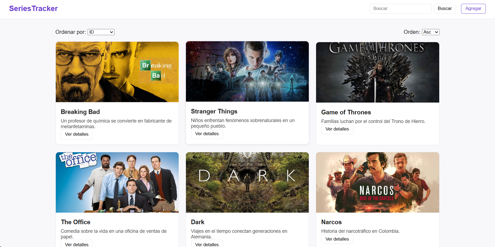
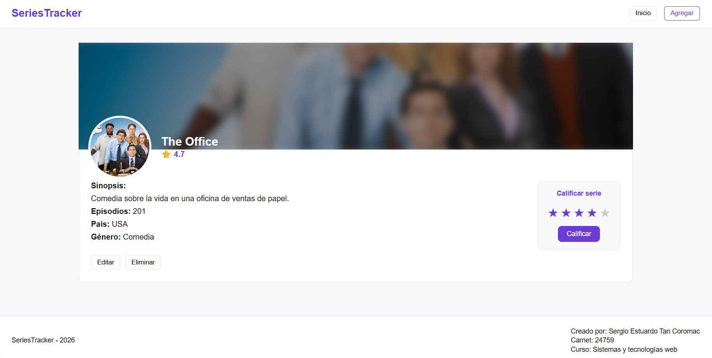
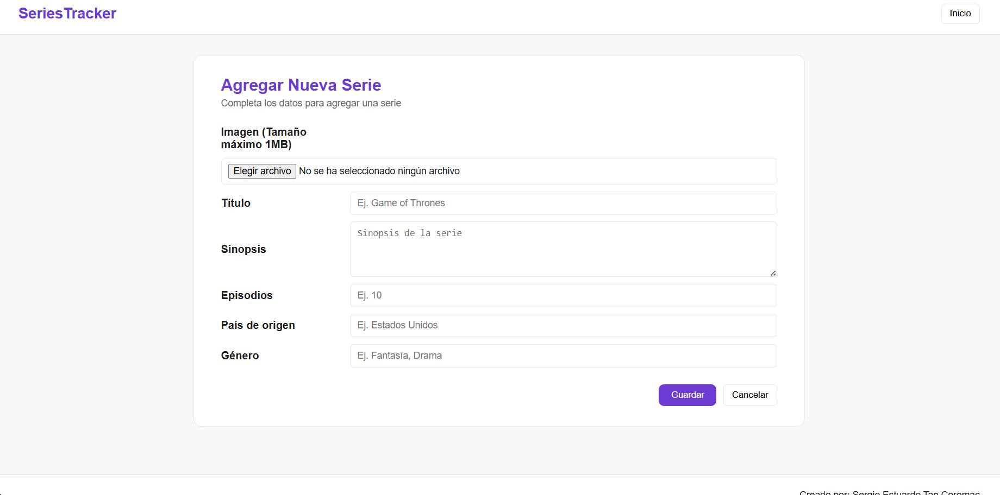

# SeriesTracker — Frontend

Cliente web para gestionar y calificar series de televisión. Construido con **HTML, CSS y JavaScript Vanilla**, consume la API REST del backend mediante `fetch()`.

> **Repositorio del Backend:** https://github.com/stan-2021131/SeriesTracker_Backend
> **Aplicación en producción:** [_enlace al deploy_]

---

## Screenshot

* Página principal



* Página de detalle



* Formulario



---

## Estructura del repositorio

```
SeriesTracker_Frontend/
├── index.html        # Página principal — lista de series con búsqueda, filtros y paginación
├── detail.html       # Página de detalle de una serie — info, editar, eliminar y calificar
├── form.html         # Formulario para crear o editar una serie
├── css/
│   └── styles.css    # Estilos globales de la aplicación
└── js/
    ├── api.js        # Funciones genéricas para consumir la API (GET, POST, PUT, DELETE)
    ├── config.js     # Configuración global (URL base de la API)
    ├── list.js       # Lógica de la página principal (listar, buscar, ordenar, paginar)
    ├── detail.js     # Lógica de la página de detalle (cargar info, rating, eliminar, editar)
    └── form.js       # Lógica del formulario (crear y editar series)
```

---

## ⚙️ Cómo correr el proyecto localmente

El frontend es puro HTML/CSS/JS estático, por lo que **no requiere instalación**.

### Abrir directamente

Puedes abrir `index.html` directamente en el navegador, aunque algunas peticiones `fetch()` pueden fallar por restricciones de `file://`.

---

## 🔌 Configuración de la URL del backend

La URL base del backend se encuentra en `js/api.js`:

```js
const CONFIG = {
    API_URL: "http://localhost:3005"
}
```

Cámbiala según el entorno donde esté corriendo el backend (local o producción).

---

## 🌍 CORS

Cors es un sistema de seguridad que evita que clientes no autorizados puedan acceder al API. Con esto el servidor puede mantenerse seguro y dejar que solo clientes autorizados puedan acceder a sus recursos.


---

## 🚀 Funcionalidades implementadas

| Funcionalidad | Descripción |
|---|---|
| **Listar series** | Muestra todas las series en tarjetas con portada, título y sinopsis |
| **Búsqueda** | Filtrado por nombre usando el parámetro `?q=` |
| **Ordenamiento** | Ordena por ID, título, episodios o fecha (`?sort=` y `?order=asc\|desc`) |
| **Paginación** | Navega entre páginas con controles Anterior/Siguiente (`?page=` y `?limit=`) |
| **Ver detalle** | Página dedicada con toda la información de la serie y su portada |
| **Crear serie** | Formulario para agregar una nueva serie con imagen |
| **Editar serie** | El mismo formulario precargado con los datos actuales |
| **Eliminar serie** | Botón de eliminar con confirmación |
| **Sistema de rating** | Selección de estrellas (1–5) y envío a la API; muestra el promedio actual |
| **Subida de imágenes** | Soporte para subir portadas desde el formulario (enviadas como `multipart/form-data`) |

---

## 🏗️ Arquitectura del cliente

El cliente está organizado en archivos con responsabilidades claras y separadas:

- **`api.js`** — Capa de comunicación con el backend. Expone `apiGet`, `apiPost`, `apiPostForm`, `apiPut` y `apiDelete`. Centraliza el manejo de errores HTTP.
- **`list.js`** — Controla la página principal: consulta la API con los parámetros actuales (búsqueda, orden, página) y renderiza las tarjetas de series.
- **`detail.js`** — Carga el detalle de una serie, gestiona la interacción de rating (hover + click + botón "Calificar") y los botones de editar/eliminar.
- **`form.js`** — Detecta si se está creando o editando (por el parámetro `?id=` en la URL), precarga los datos en modo edición y envía el formulario con `FormData`.

---

## ✅ Challenges implementados

- [x] Sistema de rating (tabla propia, endpoints REST, visible en el cliente)
- [x] Subida de imágenes (multipart/form-data, límite ~1 MB)

---

## 💭 Reflexión

Pocas veces he utilizado html y js puro. Ya que siempre me habían enseñado a usar frameworks como react. Así que que me resulta interesante como mediante la manipulación del DOM podemos lograr resultados más complejos en nuestras páginas sin necesidad de estructuras complejas.

Esto me resultaría extremadamente útil en proyectos personales donde no hay contenido dinamico. Por ejemplo una especie de portfolio personal.

---

## 👤 Autor

**Sergio Estuardo Tan Coromac** — Carnet 24759  
Curso: Sistemas y Tecnologías Web — 2026